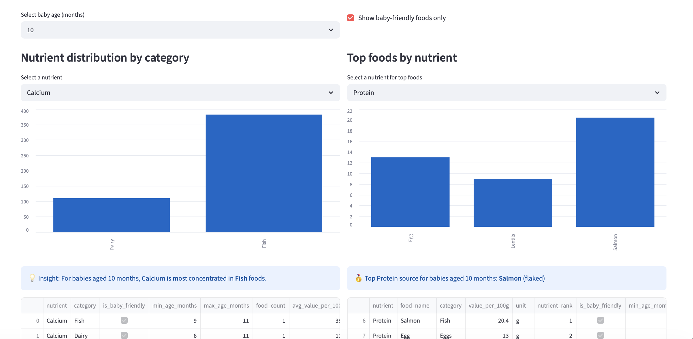

# 🌱 NourishMama

**Nutrition insights for first-time mums and baby-friendly foods under 1 year**

NourishMama is an end-to-end data pipeline built with **Bruin** that delivers actionable nutrition insights for **nursing mothers** and **babies under 1 year**.

It enables users to explore:
- Nutrient-rich foods by category
- Age-appropriate foods for babies (6–11 months)
- Top foods for key nutrients like Iron, Calcium, Protein, and more

---

## 🚀 Problem Statement

First-time mothers often struggle with:
- Knowing which foods support recovery and breastfeeding
- Identifying safe, nutrient-rich foods for babies at different ages

Existing resources are scattered and not data-driven.

👉 **NourishMama solves this by providing a data-driven dashboard that connects maternal nutrition and baby feeding recommendations in one place.**

---

## 🧠 What This Project Does

This project builds a complete data pipeline that:

1. Ingests nutrition data
2. Transforms it into structured, analysis-ready datasets
3. Produces analytical tables for insights
4. Powers an interactive dashboard

---


---

## ⚙️ Tech Stack

- **Data Platform**: Bruin
- **Data Warehouse**: DuckDB
- **Transformation**: SQL (Bruin assets)
- **Orchestration**: Bruin pipeline DAG
- **Dashboard**: Streamlit
- **Language**: Python

---

## 📦 Data Model

### Key Features

- `target_group`: baby | mother | both
- `is_baby_friendly`: TRUE/FALSE
- `min_age_months`, `max_age_months`
- `texture_stage` (e.g., mashed, soft, flaked)

---

## 📊 Dashboard Features

### 1️⃣ Nutrient Distribution by Category
- Shows how nutrients (e.g., Calcium, Iron) are distributed across food groups
- Helps identify **which categories are richest in nutrients**

### 2️⃣ Top Foods by Nutrient
- Ranks foods based on nutrient content
- Highlights **best food choices for mothers or babies**

---

## 🎛️ Interactive Filters

- 👶 Baby age (6–11 months)
- 👩 Audience:
  - Baby under 1
  - Mother
  - Both

---

## 📸 Dashboard Preview



---

## ▶️ How to Run the Project

### 1. Clone the repository

```bash
git clone https://github.com/kachiann/bruin.git
cd nourishmama_pipeline
```

### 2. Run the pipeline
```bash
bruin run nourishmama_pipeline
```

### 3. Launch the dashboard
```bash
cd nourishmama_pipeline
streamlit run app.py
```
